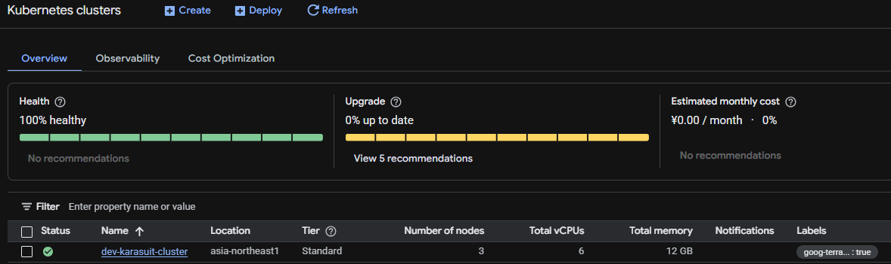
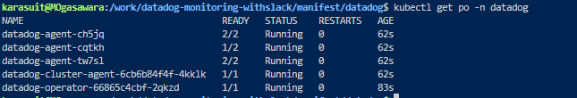
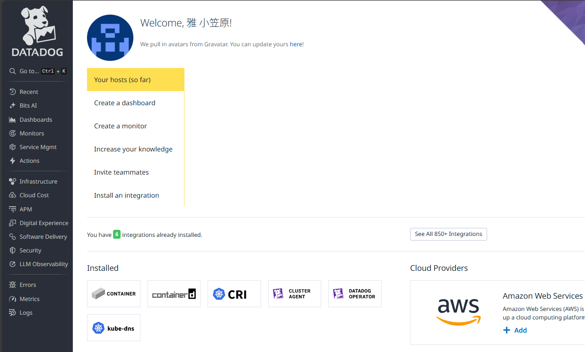
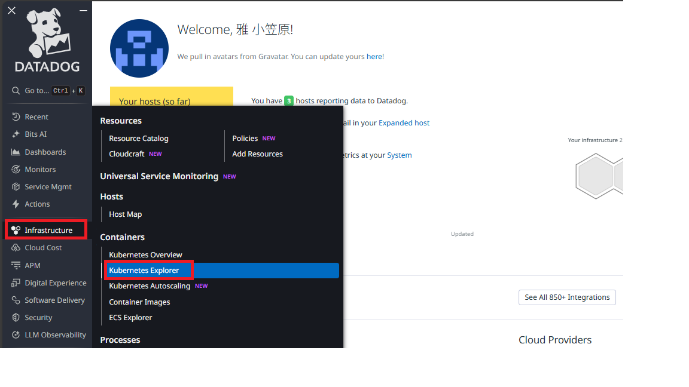
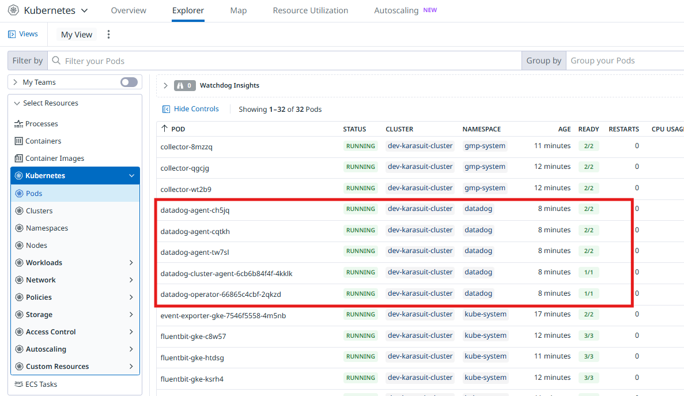
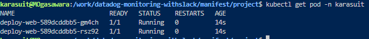
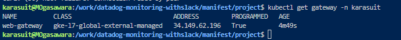
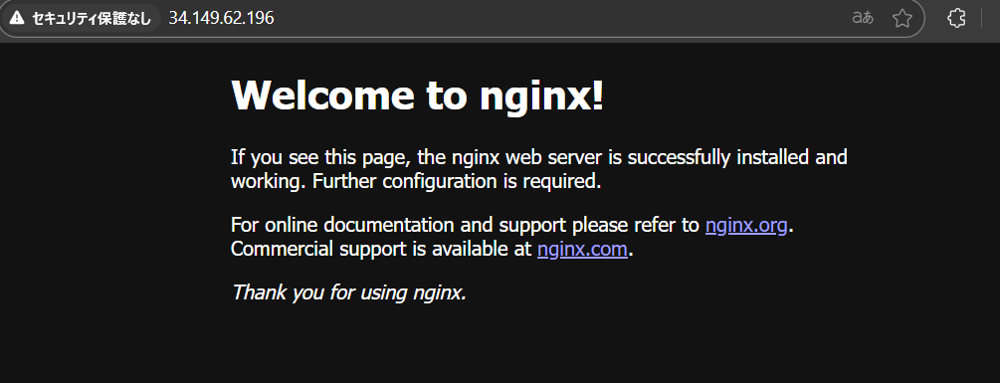
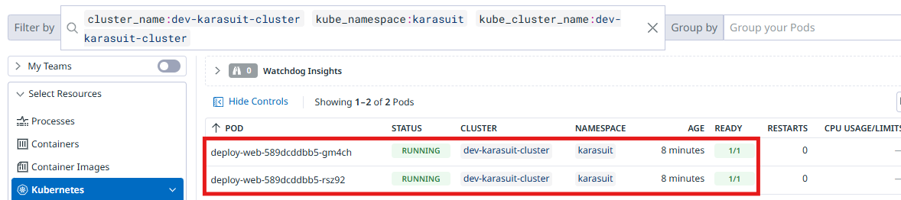

## Phase 1 - Datadog をデプロイする

### 概要

GoogleCloud 上の GKE にて Datadog をデプロイし、別途デプロイしたコンテナのメトリクス情報を  
Datadog のコンソール画面にて表示できることを確認する

---

### 手順

#### 1. Terraform 用の tf ファイル群を作成

※本レポジトリの tree 構成は以下の通り

<pre><code>
├── envs
│   └── dev
│       ├── backend.tf
│       ├── locals.tf
│       ├── main.tf
│       ├── outputs.tf
│       └── provider.tf
├── manifest
│   ├── datadog
│   │   ├── datadog-agent.yaml
│   │   ├── datadog-operator.yaml
│   │   ├── ns.yaml
│   │   └── secret.yaml
│   └── project
│       ├── deploy-web.yaml
│       ├── gateway.yaml
│       ├── ns.yaml
│       ├── standard-install.yaml
│       └── svc.yaml
└── modules
    ├── gke
    │   ├── outputs.tf
    │   ├── project_cluster.tf
    │   └── variables.tf
    └── network
        ├── network.tf
        ├── outputs.tf
        └── variables.tf
</code></pre>

- state 状態を管理するため、Cloud Storage 上に格納する
- 今回は dev 環境のみの構築であるが、stg/prd 環境での構築を想定し、modules から呼び出す構成にしている

### 2. Datadog 関連の yaml ファイル取得

ローカル上で以下のコマンドを実行し、Datadog チャートを元にデプロイのために必要な yaml ファイルを取得する

<pre><code>
helm repo add datadog https://helm.datadoghq.com
helm repo upgrade
helm template datadog-operator datadog/datadog-operator --namespace datadog --create-namespace > datadog-operator.yaml
</code></pre>

以下の URL を参考に、datadog-agent.yaml を作成する

https://docs.datadoghq.com/ja/containers/kubernetes/installation/?tab=datadogoperator

◆datadog-agent.yaml

<pre><code>
apiVersion: datadoghq.com/v2alpha1
kind: DatadogAgent
metadata:
  name: datadog
  namespace: datadog
spec:
  global:
    clusterName: dev-karasuit-cluster
    site: ap1.datadoghq.com
    credentials:
      apiSecret:
        secretName: datadog-secret
        keyName: api-key
</code></pre>

API キーを含む ConfigMap 作成用の yaml ファイルを作成する

◆secret.yaml

<pre><code>
apiVersion: v1
kind: Secret
data:
  api-key: [API キー]
metadata:
  name: datadog-secret
  namespace: datadog
type: Opaque
</code></pre>

#### 3. terraform apply の実施

dev フォルダにカレントディレクトリを移動し、以下のコマンドで GoogleCloud 上にリソースを作成  
※GKE クラスタは Datadog の都合上 DaemonSet を使用するので、Standard モードを使用する  
※他追加デプロイ用の Manifest ファイルや、GKE クラスタの設定は過去作成したものを使用するため割愛

<pre><code>
terraform init
terraform plan
terraform apply --auto-approve
</code></pre>

#### 4. GKE クラスタの認証情報を取得

※google-cloud-cli-gke-gcloud-auth-plugin が未インストールであれば以下のコマンドを実施しておくこと

<pre><code>
sudo apt-get install google-cloud-cli-gke-gcloud-auth-plugin
</code></pre>

ローカル環境上で以下のコマンドを実施し、GKE 上で構築したクラスタへの認証情報を取得する

<pre><code>
gcloud container clusters get-credentials <クラスタ名> \
  --region <リージョン名> \
  --project <プロジェクトID>
</code></pre>

※上記コマンド実行により current-context の向き先が GKE になっていることを確認する

<pre><code>
kubectl config current-context
</code></pre>

#### 5. manifest ファイルから pod をデプロイ(Datadog)

manifest/datadog フォルダにカレントディレクトリを移動する

以下のコマンドを実行し、manifest ファイルを apply する

<pre><code>
kubectl apply -f ns.yaml
kubectl apply -f ./
※namespace作成前に後続が走るとエラーになるため、先んじてnamespace作成用のyamlを適用させている  
</code></pre>

以下のコマンドを実行し、pod が running になっていることを確認

<pre><code>
kubectl get pod -n datadog
</code></pre>

#### 6. Datadog コンソール への接続

以下の URL より、Datadog のコンソールに接続する

https://ap1.datadoghq.com/account/login?redirect=f

画面左側のタブより、Infrastructure - Kubernetes Explorer をクリックし、  
前段で確認した Pod が表示されていることを確認する

#### 7. manifest ファイルから pod をデプロイ(Project)

manifest/project フォルダにカレントディレクトリを移動する

以下のコマンドを実行し、manifest ファイルを apply する

<pre><code>
kubectl apply -f ns.yaml
kubectl apply -f ./
※namespace作成前に後続が走るとエラーになるため、先んじてnamespace作成用のyamlを適用させている  
</code></pre>

以下のコマンドを実行し、pod が running になっていることを確認

<pre><code>
kubectl get pod -n karasuit
</code></pre>

以下のコマンドを実行し、gateway の IP アドレスを確認し、  
上記の IP アドレスをブラウザで入力し、nginx のデフォルト画面が表示されることを確認する

<pre><code>
kubectl get pod -n karasuit
</code></pre>

Datadog にて、前段でデプロイした Pod が監視対象として表示されていることを確認する

