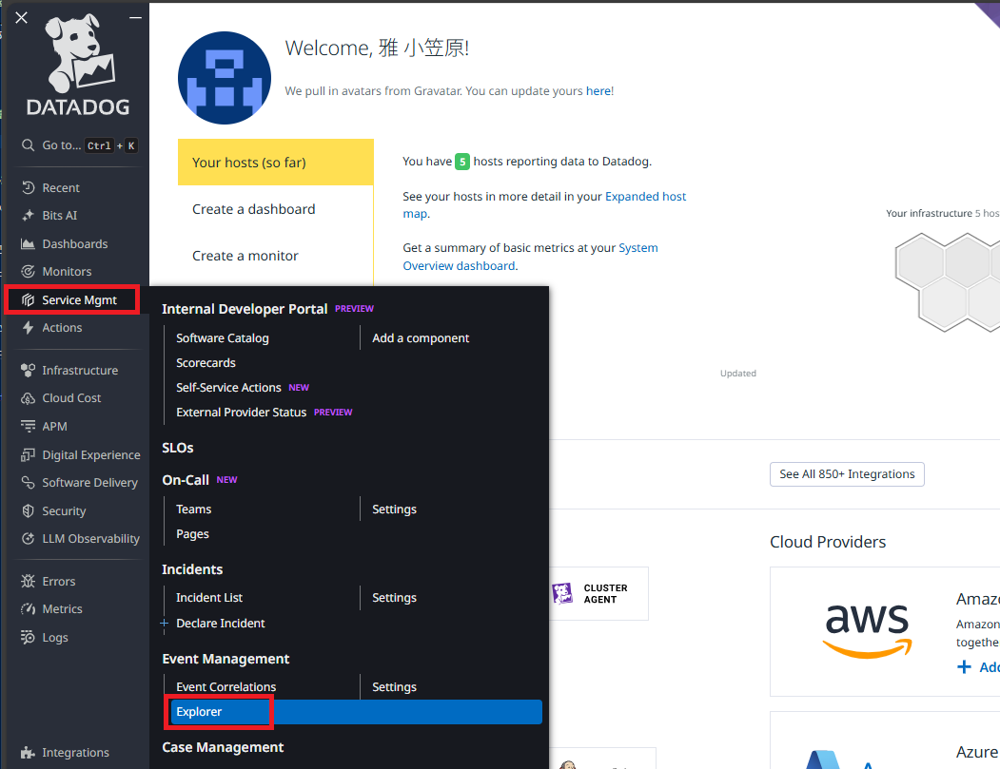
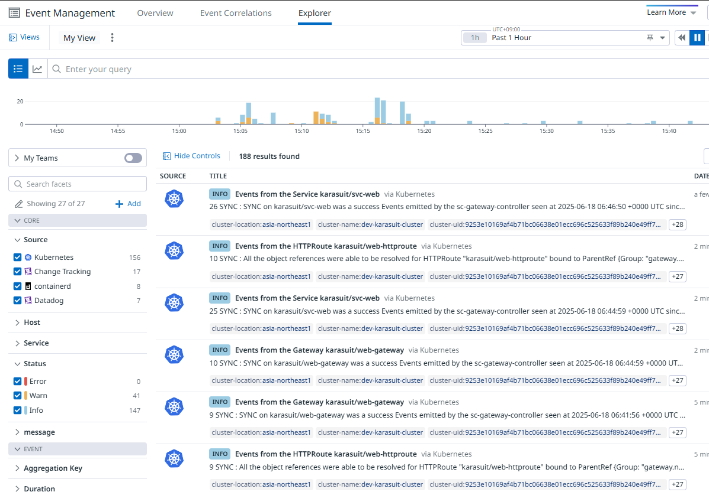
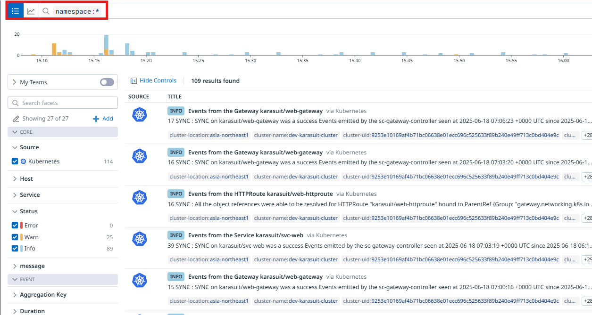
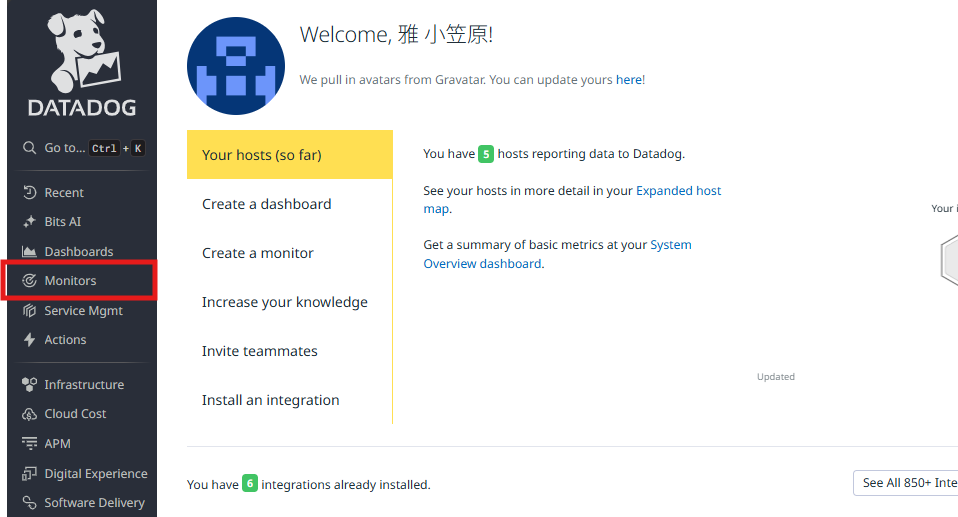
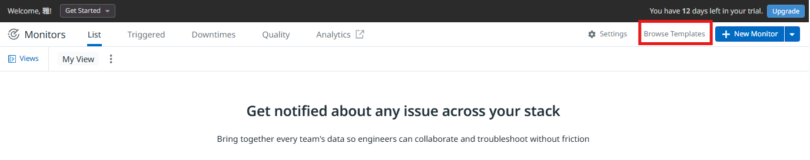
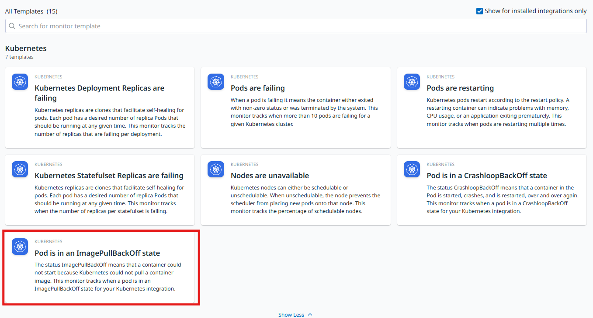
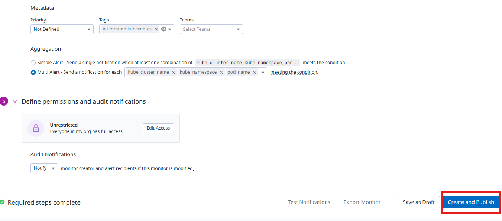
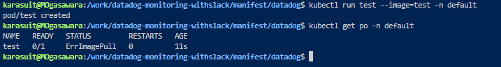
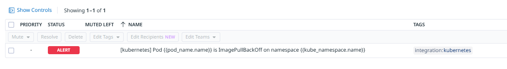
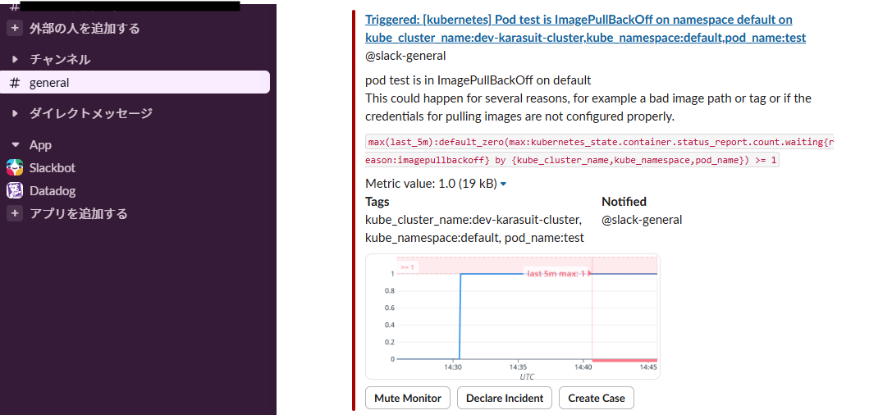

## Phase 2 - Slack にてアラート通知を受け取るようにする(From Datadog)

### 概要

karasuit NameSpace 上でデプロイした Pod にてエラーが発生した場合、Slack 経由で  
Datadog からアラートを受け取るようにする

---

### 手順

#### 1. 現状のイベント情報について確認

Datadog UI の画面左のタブより Service Mgmt - Event Management - Explorer を選択する

検索バーにて namespace:\* と入力しすべての namespace 上のイベントを取得する

### 2. Datadog にて Monitor を追加する

Datadog UI の画面左のタブより Service Mgmt - Event Management - Explorer を選択する

Browse Templates をクリックする

「pod is in an ImagePullBackOff state」Template を選択する

Create and Publish をクリックする  
※Image Pull 時に存在しないイメージを使用してデプロイ時にアラート検知する

ローカル環境にて以下のコマンドを実行し、意図的に存在しない Image を指定して Pod をデプロイする

<pre><code>
kubectl run test --image=test -n default
</code></pre>

コンソール画面より、Alert が検知されていることを確認する  
※確認後 test Pod は削除する

#### 3. Slack 側の設定

※Slack 通知設定については個人情報が非常に多いため最終的な画面のみ添付

