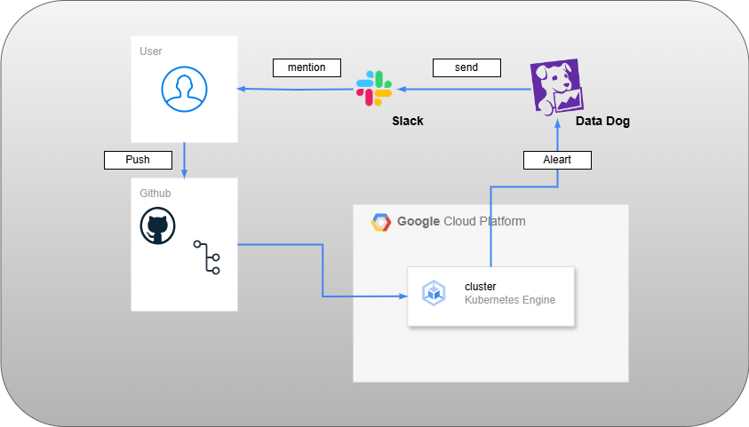

## 概要

GKE を使用し、Datadog を使用したモニタリング基盤を構築し、ダッシュボードの操作感を学ぶ  
また、クラスタ上にデプロイした Pod にエラーが発生した場合にエラー内容を Slack 通知できるシステムを構築する
Slack への発報方法として Datadog → Slack パターンを想定する

## 目的

- Datadog の UI にてどういった操作感なのかを触って確かめてみる
- Slack にてアラート発報時にどうやって利用者宛に通達されるのかを設定の観点で実践する
- Dtatadog を使用する場合と、Cloud Monitoring だけで監視をする場合の違いをそれぞれ構築して差異を確認する

## アーキテクチャ図

## 前提条件

- GitHub 上に以下のリポジトリを作成しておく：
- [datadog-monitoring-withslack](https://github.com/Karasu1t/datadog-monitoring-withslack)
- GoogleCloud アカウントを作成し、予め必要な API の有効化および terraform のための ServiceAccount を作成している
- Datadog アカウントを作成し、予め API キーを取得していること
- 本学習を進めるにあたり以下のバージョンで実施しています。

1.  OS Ubuntu(WSL) 5.15.167.4-microsoft-standard-WSL2
2.  Terraform v1.12.1
3.  Google Cloud SDK 522.0.0
4.  kubectl v1.30.0
5.  helm v3.18.2

## フェーズ構成

本環境構築は以下のフェーズに分けて進める：

1. **GKE で Datadog をデプロイし、別途作成したコンテナのメトリクス情報を Datadog にて確認できること**
2. **Slack に Datadog アプリをインストールし、アラート発報時に Slack にて通知を受け取ることが出来ること**
3. **Cloud Function で Monitoring し、アラート時 Slack で通知を受け取ることが出来ること**

---

各フェーズの詳細手順や設定内容については、以降のセクションに記載。

[Phase 1 - Datadog をデプロイする](https://github.com/Karasu1t/datadog-monitoring-withslack/blob/main/Phase1.md)  
[Phase 2 - Slack にてアラート通知を受け取るようにする(From Datadog)](https://github.com/Karasu1t/datadog-monitoring-withslack/blob/main/Phase2.md)

## 注意事項

- ServiceAccount の権限については事前定義ロールを使用
- dev フォルダ配下に locals.tf が本来あるがプロジェクト ID の記載があるため、セキュリティの兼ね合いで git 上に掲載せず
- ServiceAccount の key についても同様
- Datadog は無料トライアル期間中に実施している
- Slack アカウントおよびワークスペースを作成していること
